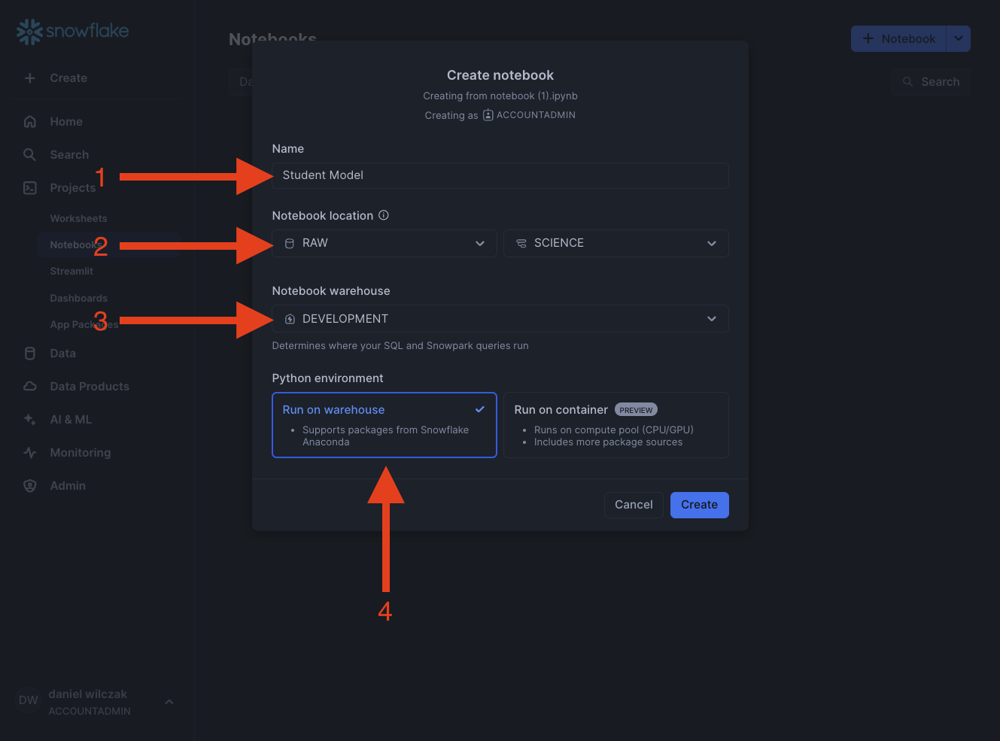

# Snowflake Model Registry
In this tutorial we will show how you can create a model in a notebook, save that model to the model registry and deploy/use that model via SQL.

## Video
Video still in development

## Requirement
- Snowflake account, you can use a [free trial](https://signup.snowflake.com/). We also assume no complex security needs.

## Download needed files:
- Notebook ([Link](https://sfc-gh-dwilczak.github.io/tutorials/snowflake/science/model_registry/notebook/notebook.ipynb))

## Setup :octicons-feed-tag-16:
Lets start by adding some sample data and uploading our notebook. 

??? note "If you don't have a database, schema or warehouse yet."

    === ":octicons-image-16: Database, schema and warehouse"

        ```sql
        use role accoutadmin;
        
        -- Create a database to store our schemas.
        create database if not exists raw;

        -- Create the schema. The schema stores all our objectss.
        create schema if not exists raw.science;

        /*
            Warehouses are synonymous with the idea of compute
            resources in other systems. We will use this
            warehouse to call our user defined function.
        */
        create warehouse if not exists development 
            warehouse_size = xsmall
            auto_suspend = 30
            initially_suspended = true;

        use database raw;
        use schema science;
        use warehouse development;
        ```

### Sample data
First lets start by creating some sample data for our model to train from.
=== ":octicons-image-16: Code"

    ```sql linenums="1"
    use role accountadmin;

    -- Sample Data
    create or replace table student_test_scores as
        select
            $1 as hours_studied,
            $2 as test_score
        from values
            (1.0, 3.5),
            (2.0, 9.2),
            (3.0, 13.1),
            (4.0, 24.7),
            (5.0, 28.5),
            (6.0, 41.0),
            (7.0, 50.3),
            (8.0, 63.5),
            (9.0, 82.1),
            (10.0, 95.0);
    ```   

=== ":octicons-image-16: Result"

    ``` linenums="1"
    | status                                          |
    |-------------------------------------------------|
    | Table STUDENT_TEST_SCORES successfully created. |
    ```

### Upload and Setup Notebook
Lets upload our [notebook we downloaded](https://sfc-gh-dwilczak.github.io/tutorials/snowflake/science/model_registry/notebook/notebook.ipynb) earlier. Start by navigating to noteboobs and clicking ``import .ipynb file``.


Next we'll name it and select the location and that we want to run via a warehouse.


Our final step before running install the needed package ``snowflake-ml-python`` to build and save our model. The package comes with ``sklearn`` with it.


## Run the notebook
To run the notebook we'll click ``run all``. 


Once the model is run we can refresh our schema to see a model object has been added. We'll want to open the details to get our metrics we saved in the notebook. 


We can click on the version we just created.


We can see the metadata  our model and also the functions we will use in the next section to make predictions via SQL.


## Use the model via SQL
Now that we have our model saved into our model registry, lets use the model via sql to make a prediction. Lets open a new worksheet.

=== ":octicons-image-16: Code"

    ```sql linenums="1"
    -- Using the default version.
    select
        8 as hours_studied,

        raw.science.predict_test_score!predict(hours_studied) as result,

        result:output_feature_0::float as prediction;
    ```   

=== ":octicons-image-16: Result"

    ``` linenums="1"
    | HOURS_STUDIED | RESULT                                          | PREDICTION  |
    |---------------|-------------------------------------------------|-------------|
    | 8             | {   "output_feature_0": 6.647030303030303e+01 } | 66.47030303 |
    ```


We can also select specific versions if we have multiple or want to retrieve the latest model version..

=== ":octicons-image-16: Code"

    ```sql linenums="1"
    -- Selecting a specific model version.
    with
        predict_test_score as model raw.science.predict_test_score version last

    select
        3.5 as hours_studied,
        predict_test_score!predict(hours_studied) as result,
        result:output_feature_0::float as prediction;
    ```   

=== ":octicons-image-16: Result"

    ``` linenums="1"
    | HOURS_STUDIED | RESULT                                          | PREDICTION   |
    |---------------|-------------------------------------------------|--------------|
    | 3.5           | {   "output_feature_0": 2.586181818181818e+01 } | 25.861818182 |
    ```

## Change default version
Updating the version can allow us to make sure downstream users are using the correct model.

=== ":octicons-image-16: Code"

    ```sql linenums="1"
    alter model
        predict_test_score
    set
        default_version = <Model version name>;
    ```   

=== ":octicons-image-16: Example"

    ```sql linenums="1"
    alter model
       predict_test_score
    set
        default_version = V20241122_114535;
    ```  

=== ":octicons-image-16: Result"

    ``` linenums="1"
    | status                           |
    |----------------------------------|
    | Statement executed successfully. |
    ```
