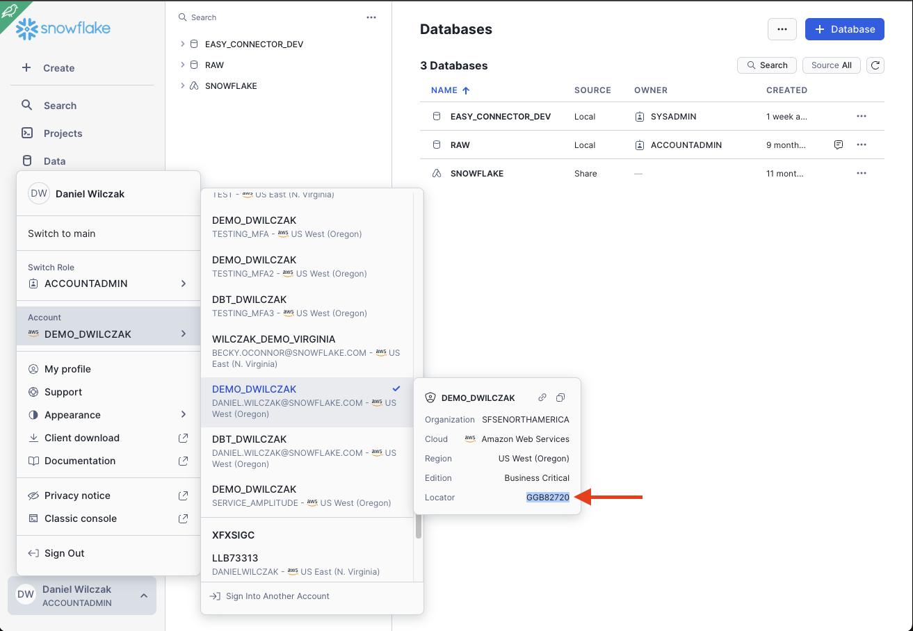

# Key Pair Authentication
In this tutorial we will show how to connect to your Snowflake account via python with an authentication token/key.

For the official Snowflake documentation this tutorial was based on:
[https://docs.snowflake.com/en/user-guide/key-pair-auth](https://docs.snowflake.com/en/user-guide/key-pair-auth)

## Video
Video is still in development.

## Requirement
- This tutorial assumes you have nothing in your Snowflake account ([Trial](https://signup.snowflake.com/)) and no complex security needs.
- This tutorial assumes you've already have a private key, [if not here is a tutorial](https://sfc-gh-dwilczak.github.io/tutorials/snowflake/security/key_pair/)

## Setup :octicons-feed-tag-16:
Lets get start with our setup.

## Dependencies
Lets pip install the needed packages first. I reccomend doing this in a python virtual envirement via ``python3 -m venv venv``.
=== ":octicons-image-16: Setup"

    ```bash linenums="1"
    pip3 install snowflake-connector-python
    pip3 install cryptography
    ```

### Code
Here is the code we'll use. Please fill in the two needed areas.

!!! warning "Using the correct account locator."

    If your Snowflake account is in anther region other then US EAST (Oregon). Please append your locator with the region ``xy12345.us-east-1`` read the [Account Identifiers](https://docs.snowflake.com/en/user-guide/admin-account-identifier#non-vps-account-locator-formats-by-cloud-platform-and-region) documentation to learn how to format your account locator based on your region. 

=== ":octicons-image-16: Setup"

    ```python linenums="1"
    import snowflake.connector
    import os
    from cryptography.hazmat.backends import default_backend
    from cryptography.hazmat.primitives.asymmetric import rsa
    from cryptography.hazmat.primitives.asymmetric import dsa
    from cryptography.hazmat.primitives import serialization

    # Load the private key from a file
    with open("rsa_key.p8", "rb") as key:
        p_key = serialization.load_pem_private_key(
            key.read(),
            password=None,
            backend=default_backend()
        )

    # Convert the private key to bytes
    pkb = p_key.private_bytes(
        encoding=serialization.Encoding.DER,
        format=serialization.PrivateFormat.PKCS8,
        encryption_algorithm=serialization.NoEncryption()
    )

    # Connect to Snowflake
    ctx = snowflake.connector.connect(
        user='<User Name>',  #(1)! 
        account='<Account Locator>',  #(2)!
        private_key=pkb
    )

    # Create a cursor
    cs = ctx.cursor()

    # Example query
    try:
        cs.execute("select current_user()")
        result = cs.fetchone()
        print(result)
    finally:
        cs.close()
        ctx.close()
    ```
    { .annotate }
    
    1.  Name we gave to the user in our setup section.

    2.  
        

=== ":octicons-image-16: Example"

    ```python linenums="1"
    import snowflake.connector
    import os
    from cryptography.hazmat.backends import default_backend
    from cryptography.hazmat.primitives.asymmetric import rsa
    from cryptography.hazmat.primitives.asymmetric import dsa
    from cryptography.hazmat.primitives import serialization

    # Load the private key from a file
    with open("rsa_key.p8", "rb") as key:
        p_key = serialization.load_pem_private_key(
            key.read(),
            password=None,
            backend=default_backend()
        )

    # Convert the private key to bytes
    pkb = p_key.private_bytes(
        encoding=serialization.Encoding.DER,
        format=serialization.PrivateFormat.PKCS8,
        encryption_algorithm=serialization.NoEncryption()
    )

    # Connect to Snowflake
    ctx = snowflake.connector.connect(
        user='danielwilczak',
        account='GGB82720',
        private_key=pkb
    )

    # Create a cursor
    cs = ctx.cursor()

    # Example query
    try:
        cs.execute("select current_user()")
        result = cs.fetchone()
        print(result)
    finally:
        cs.close()
        ctx.close()
    ```

=== ":octicons-image-16: Result"

    ``` linenums="1"
    ('DANIELWILCZAK',)
    ```