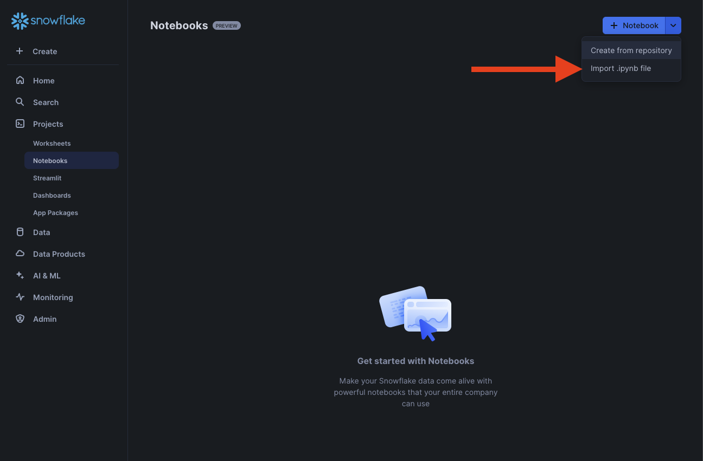
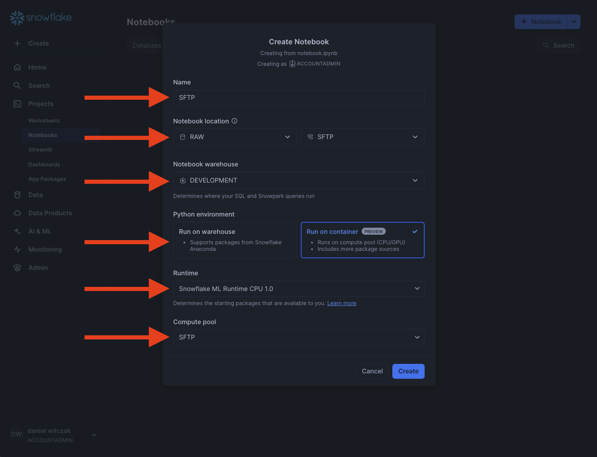
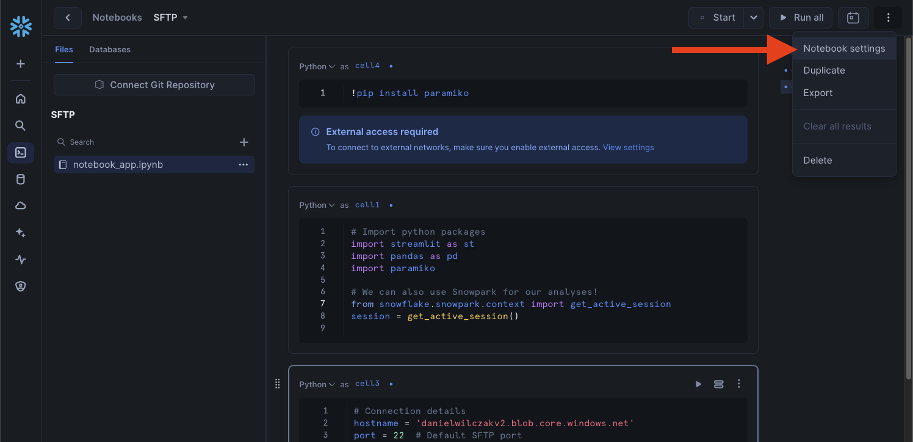
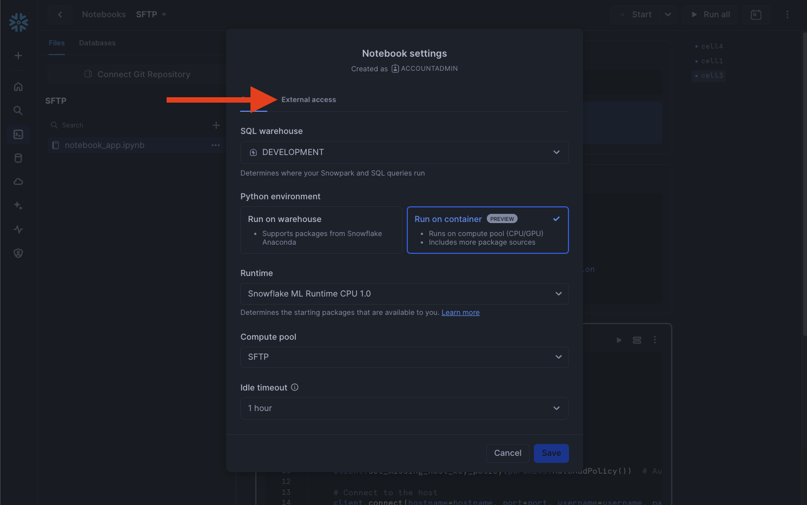
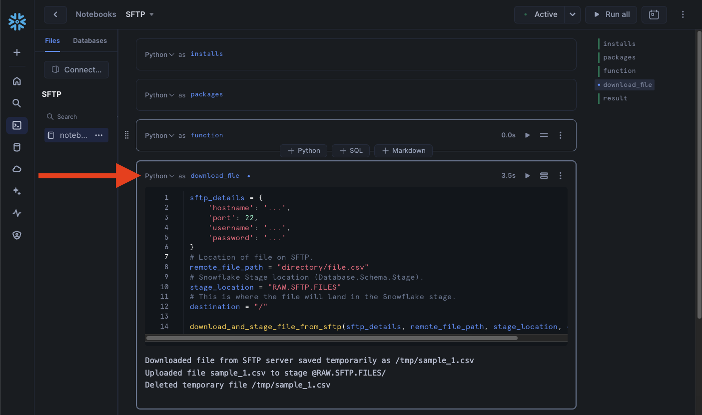

# SFTP to Snowflake Stage - Using containerized notebooks
In this tutorial we will show how you can takes files from an sftp and load them into a Snowflake stage to later be loaded into a table.

## Video
Video is still in development.

## Requirement
You must have a Snowflake account that is not on a trial. This is a requirement of [container services](https://docs.snowflake.com/developer-guide/snowpark-container-services/working-with-compute-pool), not the tutorial.

## Download needed files:
- Notebook ([Link](https://sfc-gh-dwilczak.github.io/tutorials/snowflake/sftp/files/notebook.ipynb))

## Setup :octicons-feed-tag-16:
Lets start the network setup prcoess in Snowflake. 

??? note "If you don't have a database, schema or warehouse yet."

    === ":octicons-image-16: Database, schema and warehouse"

        ```sql
        use role sysadmin;
        
        -- Create a database to store our schemas.
        create database if not exists raw;

        -- Create the schema. The schema stores all our objectss.
        create schema if not exists raw.sftp;

        /*
            Warehouses are synonymous with the idea of compute
            resources in other systems. We will use this
            warehouse to call our user defined function.
        */
        create warehouse if not exists development 
            warehouse_size = xsmall
            initially_suspended = true;

        use database raw;
        use schema sftp;
        use warehouse development;
        ```


First lets start by setting up the network rules, stage and compute pool in a worksheet to allow our Snowflake Notebook to talk with our external source.
=== ":octicons-image-16: Setup"

    ```sql linenums="1"
    -- We use sysadmin because accountadmin can't be used in the containized notebooks.
    use role sysadmin;

    -- We will store our files in the stage.
    create stage if not exists files directory = ( enable = true );

    -- This is the compute needed for our notebook.
    create compute pool sftp
        min_nodes = 1
        max_nodes = 1
        instance_family = cpu_x64_xs;

    /*
    This rule allows your Snowflake to talk to all
    external I.P's. Feel free to change it to your
    needed I.P's. We also assume it's port 22.
    */
    create or replace network rule sftp_network_rule
        mode = egress
        type = host_port
        value_list = ('<UPDATE WITH YOUR URL>:22');

    -- We'll need this to download the sftp python package.
    create or replace network rule pypi_network_rule
        mode = egress
        type = host_port
        value_list = ('pypi.org', 'pypi.python.org', 'pythonhosted.org',  'files.pythonhosted.org');


    use role accountadmin;

    create or replace external access integration sftp_external_access
        allowed_network_rules = (sftp_network_rule)
        enabled = true;

    create or replace external access integration pypi_access_integration
        allowed_network_rules = (pypi_network_rule)
        enabled = true;

    grant usage on integration sftp_external_access to role sysadmin;
    grant usage on integration pypi_access_integration to role sysadmin;
    ```   

=== ":octicons-image-16: Result"

    ``` linenums="1"
    Integration PYPI_ACCESS_INTEGRATION successfully created.
    ```

### Notebook
Next lets import the example notebook in our database / schema.


Next lets assign it to our database/schema


To enable our notebook to talk outside of Snowflake we'll have to enable the notebook to use that external access we created earlier. We can do this by going to Notebooks settings.


Next clicking "external access" and then checking our external access.


Check your SFTP external access and pypi external access to give the notebook access to talk with the SFTP endpoint and PyPI to download the sftp python package.


??? note "Secret Management"

    Once the example is working I suggest to keep the password stored as a secret instead of plane text via the [secret](https://docs.snowflake.com/en/sql-reference/sql/create-secret) object. 

We'll want to update our sftp python function input parameters with the hostname,username and password. After that put in your file you want to load into a stage. It can be either a single file or a ZIP which will be unzipped and loaded into a folder in the stage.  


Finally we'll click "run all" and see our notebook start, it may take up to 5 minutes to start the compute pool, we can see the status in the bottom right.


Once finished we will see that the file we selected is loaded into the stage via the ``ls`` command to the stage


We can also see that the file is in the stage via the UI. The idea here is that we can schedule the notebook to load the files from the stftp and then use a [child on task](https://sfc-gh-dwilczak.github.io/tutorials/snowflake/tasks/lineage/intro/) to load the file via a copy into coammand.


