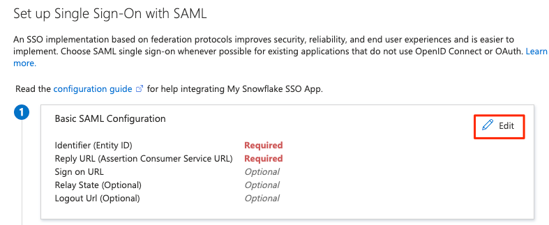
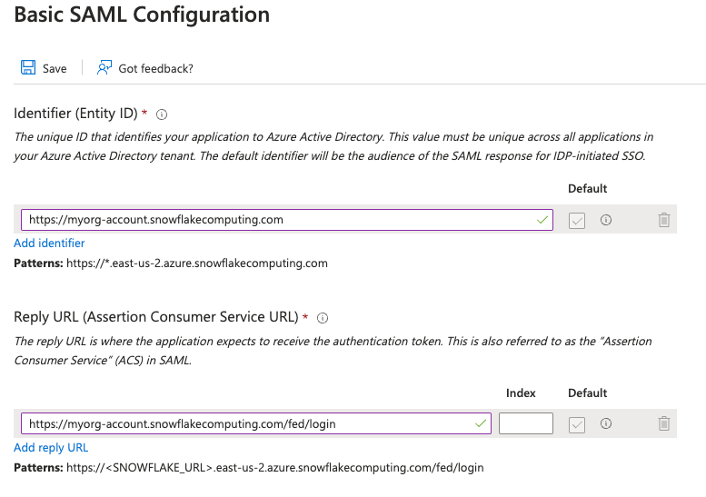

# Azure AD to Snowflake
In this tutorial we will show how to setup authenticate to Snowflake using SSO with Azure Active Directory Identity Provider. 

## Video
Video is still in developemnt.

## Azure
Lets start in azure by logging into our [azure](https://portal.azure.com/) and navigate to Microsoft Entra ID.


Next lets click on Enterprise Applications on the left navbar.


Click on new application.


In the Browse Azure AD Gallery search bar, search for Snowflake, and choose the Snowflake for AAD application.


Give your Snowflake application a name, then click the Create button at the bottom


Once the application is created, on the left side choose Single sign-on, then choose SAML in the middle pane


In the middle pane under the Basic SAML configuration section, click the Edit button


!!! warning
    If you format your URL incorrectly the SSO login will not work. Please read the [Account Identifiers](https://docs.snowflake.com/en/user-guide/admin-account-identifier#non-vps-account-locator-formats-by-cloud-platform-and-regionr) documentation to learn how to format your URL based on your snowflake service provider and location. 

In the Basic SAML Configuration section, configure the Snowflake URL your users use to access your Snowflake account. This can be found in your url when you log into snowflake. An example of this url is ``URL1``, ``URL2`` or ``URL3``

IMAGE OF URL IN SNOWFLAKE.

Next take your snowflake account url and enter it into the basic saml configuration in the format shown.


Click save and go back to the application's SAML-based Sign-on page, scroll down to the SAML Certificates section. Click Download to download the Federation Metadata XML.


## Snowflake
Next we will setup Snowflake with the information we got from our ``federation metadata xml`` file. To make this process easier I suggest formatting your XML file so it's easier to look through. I used [VS code](#) and an [xml formatter](#) to accomplish this.

Lets open a worksheet in snowflake and enter the code below by entering in the nessery areas from our federation metadata xml file..

=== ":octicons-image-16: Template"

    ```sql linenums="1"
    USE ROLE ACCOUNTADMIN;
    CREATE SECURITY INTEGRATION AZUREADINTEGRATION
    TYPE = SAML2
    ENABLED = TRUE
    SAML2_ISSUER = 'https://sts.windows.net/[...]]/'  /* (1)! */
    SAML2_SSO_URL = 'https://login.microsoftonline.com/[...]/saml2' /* (2)! */
    SAML2_PROVIDER = 'CUSTOM'
    SAML2_X509_CERT = '<IdP certificate>'  /* (3)! */
    SAML2_SP_INITIATED_LOGIN_PAGE_LABEL = 'AzureADSSO'
    SAML2_ENABLE_SP_INITIATED = TRUE;
    ```
    { .annotate }

    1. Put images of filtered text here

    2. Put images of filtered text here

    3. Put images of filtered text here

=== ":octicons-image-16: Example"

    ```sql linenums="1"
    USE ROLE ACCOUNTADMIN;
    CREATE SECURITY INTEGRATION AZUREADINTEGRATION
    TYPE = SAML2
    ENABLED = TRUE
    SAML2_ISSUER = 'https://sts.windows.net/[...]]/' 
    SAML2_SSO_URL = 'https://login.microsoftonline.com/[...]/saml2'
    SAML2_PROVIDER = 'CUSTOM'
    SAML2_X509_CERT = '<Base64 encoded IdP certificate>' 
    SAML2_SP_INITIATED_LOGIN_PAGE_LABEL = 'AzureADSSO'
    SAML2_ENABLE_SP_INITIATED = TRUE;
    ```

=== ":octicons-image-16: Result"

    Update text.

!!! success
    If you configured the Basic SAML configuration in the azure section using the Regional Locator Snowflake URL  (ADD ANOTATION HERE), your SSO configuration is completed.

!!! caution
    If you've chosen to use a different URL format such as Organization, Connection or one of the Privatelink URLs, follow the steps below. 

Review the current integration configuration. Confirm the values of the 
- SAML2_SNOWFLAKE_ACS_URL
- SAML_SNOWFLAKE_ISSUER_URL
parameters are using the Regional Locator URL (ANNOTATION NEEDED HERE). 

=== ":octicons-image-16: Check"

    ```sql linenums="1"
    desc security integration azureadintegration;
    ```

If they are not, alter the security integration by using the code below.
=== ":octicons-image-16: Alter integration"

    ```sql linenums="1"
    USE ROLE ACCOUNTADMIN;

    alter security integration azureadintegration 
        set SAML2_SNOWFLAKE_ACS_URL = 'https://<organization name>-<account name>.snowflakecomputing.com/fed/login';
    
    -- OR

    alter security integration azureadintegration
        set SAML2_SNOWFLAKE_ISSUER_URL = 'https://<organization name>-<account name>.snowflakecomputing.com';
    ```

Notes:
- The above statement uses the Organization URL as an example. You should use the URL format the Azure Single sign on application was configured with. 
- The value for the parameter SAML2_SNOWFLAKE_ACS_URL ends with /fed/login.
- The value for the parameter SAML2_SNOWFLAKE_ISSUER_URL is only the Snowflake account URL, in the format matching the Azure application configuration.