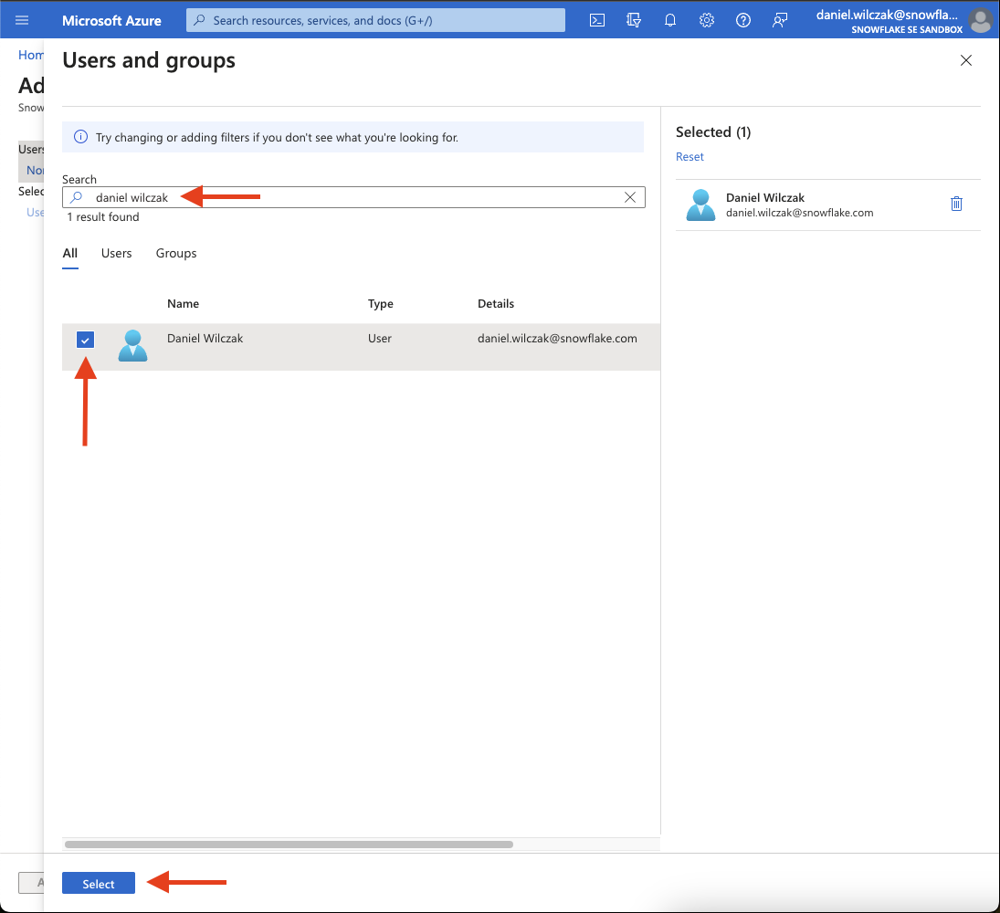
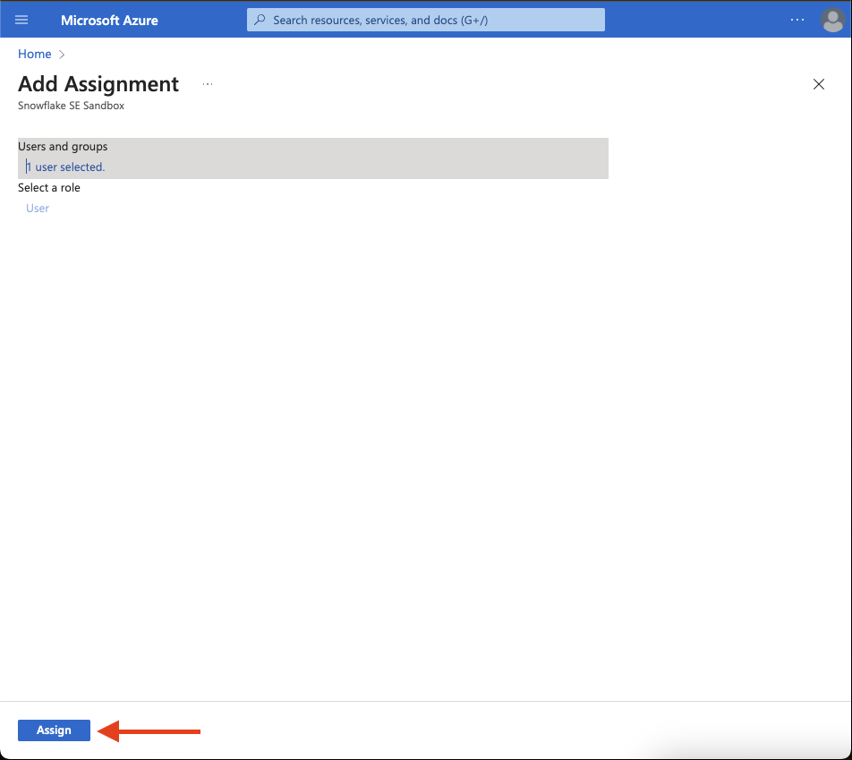

# Azure Active Directory (SSO) to Snowflake
In this tutorial we will show how to setup authenticate to Snowflake using SSO with Azure Active Directory Identity Provider. 

## Video
Video is still in developemnt.

## Azure :octicons-feed-tag-16:
Lets start in azure by setting up the SSO and then adding the users to the approved list.

### Setup
Lets start in azure by logging into our [azure](https://portal.azure.com/) and navigate to Microsoft Entra ID.


Next lets click on Enterprise Applications on the left navbar.


Click on new application.


In the Browse Azure AD Gallery search bar, search for Snowflake, and choose the Snowflake for AAD application.


Give your Snowflake application a name, then click the Create button at the bottom.


Once the application is created, on the left side choose Single sign-on, then choose SAML in the middle panel.


In the middle pane under the Basic SAML configuration section, click the Edit button.


 Next we'll want to get our Snowflake [account identifier url](). An example can be seen below that comes from ``AWS US West (Oregon)`` or you can use this chart (1).
{ .annotate }

1.  | URL type                 | URL format                                                         |
    |--------------------------|--------------------------------------------------------------------|
    | Regional                 | https://locator.region.snowflakecomputing.com                      |
    | Organization             | https://organization-name.snowflakecomputing.com                   |
    | Connection               | https://organization-connection.snowflakecomputing.com             |
    | Regional Privatelink     | https://locator.region.privatelink.snowflakecomputing.com          |
    | Organization Privatelink | https://organization-name.privatelink.snowflakecomputing.com       |
    | Connection Privatelink   | https://organization-connection.privatelink.snowflakecomputing.com |


!!! warning
    If you format your URL incorrectly the SSO login will not work. Please read the [Account Identifiers](https://docs.snowflake.com/en/user-guide/admin-account-identifier#non-vps-account-locator-formats-by-cloud-platform-and-regionr) documentation to learn how to format your URL based on your snowflake service provider and server location. 

In the Basic SAML Configuration section, configure your Identifier (Entity ID) with your snowflake account identifier URL and also again for your Reply URL (Assertion consumer service URL) but follow it with ``/fed/login`` and click save.


Go back to the application's SAML-based Sign-on page, scroll down to the SAML Certificates section. Download the Federation Metadata XML. We will use this file in our Snowflake steps.


### Add users
!!! caution
    If you don't add the user in the Azure AD group they will not be able to use the SSO login on Snowflake. 

Lets add users into the azure AD group for the application. First click on "Users and groups" on the left side nav bar and then "add user/group". 


Select Users and groups.


Select the user or groups you want to add. The search bar can be very helpful when you have alot of users/groups.


Finally click assign.



## Snowflake :octicons-feed-tag-16:
Next we will setup Snowflake with the information we got from our ``federation metadata xml`` file. To make this process easier I suggest formatting your XML file so it's easier to look through. I used [VS code](https://code.visualstudio.com/) and an [xml formatter](https://marketplace.visualstudio.com/items?itemName=redhat.vscode-xml) to accomplish this.

### Setup
Lets open a worksheet in snowflake and enter the code below by entering in the necessary areas from our federation metadata xml file..

=== ":octicons-image-16: Template"

    ```sql linenums="1"
    USE ROLE ACCOUNTADMIN;
    CREATE SECURITY INTEGRATION AZUREADINTEGRATION
    TYPE = SAML2
    ENABLED = TRUE
    SAML2_ISSUER = 'https://sts.windows.net/[...]]/'  /* (1)! */
    SAML2_SSO_URL = 'https://login.microsoftonline.com/[...]/saml2' /* (2)! */
    SAML2_PROVIDER = 'CUSTOM'
    SAML2_X509_CERT = '<IdP certificate>'  /* (3)! */
    SAML2_SP_INITIATED_LOGIN_PAGE_LABEL = 'AzureADSSO'
    SAML2_ENABLE_SP_INITIATED = TRUE;
    ```
    { .annotate }

    1. <EntityDescriptor ID="_8416250f-50fb-...8bcd335e92" entityID="https://sts.windows.net/9a2d78cb-73...fc1ac5ef57a7/"
    xmlns="urn:oasis:names:tc:SAML:2.0:metadata">

    2. <SingleSignOnService Binding="urn:oasis:names:tc:SAML:2.0:bindings:HTTP-Redirect" Location="https://login.microsoftonline.com/9a2d78c...-fc1ac5ef57a7/saml2" />

    3.  <X509Certificate>
        MIIC8DCCAdigAwIBAgIQQH4r9rnBiKlPEFVEjpdNhTANBgkqhkiG9w0BAQ
        .......
        Y9B1uSBpb4OmtWZ/LRNzHBDcDNbR oQ6PiPd2yWhtUfbYClOoNcMFOkk8E
        </X509Certificate>`

=== ":octicons-image-16: Example"

    ```sql linenums="1"
    USE ROLE ACCOUNTADMIN;
    CREATE SECURITY INTEGRATION AZUREADINTEGRATION
    TYPE = SAML2
    ENABLED = TRUE
    SAML2_ISSUER = 'https://sts.windows.net/9a2d78cb-73e9-40ee-a55...1ac5ef57a7/' 
    SAML2_SSO_URL = 'https://login.microsoftonline.com/9a2d78cb-73e...ac5ef57a7/saml2'
    SAML2_PROVIDER = 'CUSTOM'
    SAML2_X509_CERT = 'MIIC8DCCAdigAwIBAgIQQH4r9rnBiKlPEFVEjpdNhTANBgkqhkiG9w0BAQsFADA0MTIwMAYDVQQDEylNaWNyb3NvZnQgQXp1
    ......
    oQ6PiPd2yWhtUfbYClOoNcMFOkk8E6n48T33KIVtvurwWta52oLBT2eoRZbvWaglT8DLKfhpzzd0SZFYSTjyVd5k2tEzSQy8HQLfH33m6+SA2e74X1Yj' 
    SAML2_SP_INITIATED_LOGIN_PAGE_LABEL = 'AzureADSSO'
    SAML2_ENABLE_SP_INITIATED = TRUE;
    ```

=== ":octicons-image-16: Result"

    Update text.

!!! success
    If you configured the Basic SAML configuration in the azure section using the Regional Locator Snowflake URL  (ADD ANOTATION HERE), you can move on to the next step by adding users and testing your login.

??? caution "If you've chosen to use a different URL format then regional locator"
    If you've chosen to use a different URL format such as Organization, Connection or one of the Privatelink URLs, follow the steps below. 

    Review the current integration configuration. Confirm the values of the ``SAML2_SNOWFLAKE_ACS_URL`` and ``SAML_SNOWFLAKE_ISSUER_URL`` parameters are using the Regional Locator URL (ANNOTATION NEEDED HERE). 

    === ":octicons-image-16: Check"

        ```sql linenums="1"
        desc security integration azureadintegration;
        ```

    If they are not, alter the security integration by using the code below.
    === ":octicons-image-16: Alter integration"

        ```sql linenums="1"
        use role accountadmin;

        alter security integration azureadintegration 
            set SAML2_SNOWFLAKE_ACS_URL = 'https://<organization name>-<account name>.snowflakecomputing.com/fed/login';
        
        -- OR

        alter security integration azureadintegration
            set SAML2_SNOWFLAKE_ISSUER_URL = 'https://<organization name>-<account name>.snowflakecomputing.com';
        ```

    Notes:
    - The above statement uses the Organization URL as an example. You should use the URL format the Azure Single sign on application was configured with.  
    - The value for the parameter SAML2_SNOWFLAKE_ACS_URL ends with /fed/login.  
    - The value for the parameter SAML2_SNOWFLAKE_ISSUER_URL is only the Snowflake account URL, in the format matching the Azure application configuration.  

### Add or modify users.
Show how to add users with their email or if you need to alter an existing user to use an email for login.

### Testing

Show how to test your azure AD login.