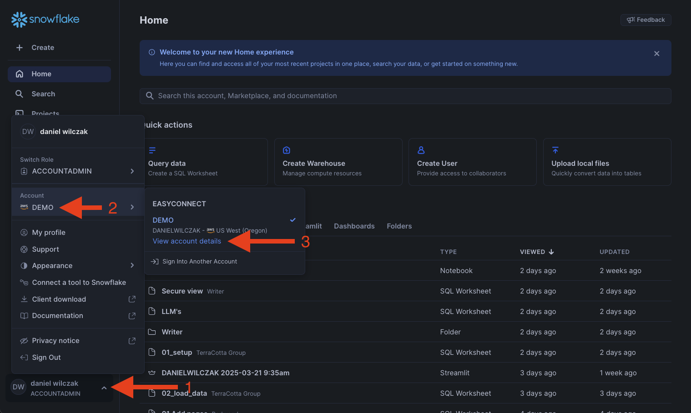
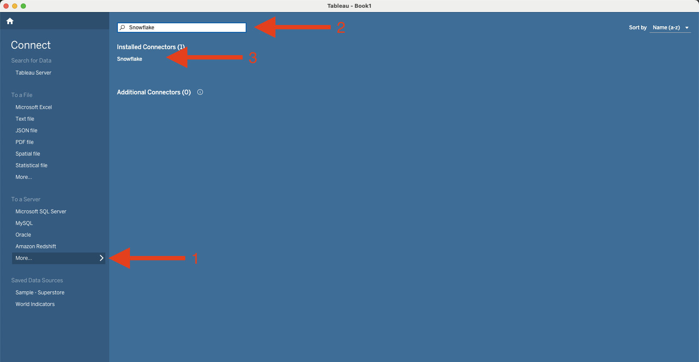

# Key Pair Authentication
In this tutorial we will show how to connect to snowflake via tableau with key-pair as the authenitcation method.

## Video
Video is still in development.

## Requirement
This tutorial assumes you have nothing in your Snowflake account ([Trial](https://signup.snowflake.com/)) and no complex security needs.

!!! warning "Tableau requires these versions to use key-pair:"
    * Snowflake ODBC driver 3.4 or later
    * Tableau Desktop 2024.3 or later


## Setup
Lets create the private and public key so that we can apply the public key to our user.

=== ":octicons-image-16: Setup"

    ```bash linenums="1"
    openssl genrsa 2048 | openssl pkcs8 -topk8 -inform PEM -out rsa_key.p8 -nocrypt
    openssl rsa -in rsa_key.p8 -pubout -out rsa_key.pub
    ```   

=== ":octicons-image-16: Result"

    ```bash linenums="1"
    Writing RSA key.
    ```

This will create two files in the folder we are currently located.


## Snowflake
Lets start with applying our key to our user and then getting the account url.

### Apply key to user
Lets create the user, assign the user a role and finally apply the public key to our user in a worksheet.

=== ":octicons-image-16: Code"

    ```sql linenums="1"
    use role accountadmin;

    -- Create the user. Optional add type = 'service' for service accounts.
    create user <username>;

    -- Give the user a role.
    grant role <role_name> to user <username>;

    -- Apply the public key to the user.
    alter user <username> set rsa_public_key='<Public Key>';

    /* (OPTIONAL) Create a network policy and apply it to the user. 
    create network policy <policy_name>  allowed_ip_list = ('<IP ADDRESS>');

    alter user <username> set network_policy = <policy_name> ; /* 
    ```

=== ":octicons-image-16: Example"

    ```sql linenums="1"
    use role accountadmin;

    -- Create the user. Optional add type = 'service' for service accounts.
    create user danielwilczak;

    -- Give the user a role.
    grant role sysadmin to user danielwilczak;

    -- Apply the public key to the user.
    alter user danielwilczak set 
        rsa_public_key='MIIBIjANBgkqhkiG9w0BAQEFAAOCAQ8AMIIBCgKCAQEA
    zd7lfIGps+lBXrVCT05l 92rDpYUsXyjtvAu26Q2z0k3/7n7HnZNmKjreIlGQJZl
    Be0Eud4LzqGX9Vbp53G2FoZePQSy46rxXQ9bmCGlF8tGhV7gOgh7D/LGfLHhtVt+
    b4BhPWLgOqOqCDUv+MXlYN+..................bdZJtCalMpjYq0o8aC1qJVv
    +ry9W+8xmfTRUSq6B0de8Y9XBEAhJu/3tJkyDSqs7ZEXR9F02hQ3WlmfQEExaktc
    pIm1l+3beupmCoCliFfoNbdcZegiIdFmGcYRmKba+YpQ3yqpqcqAlCErdqwql8rs
    cJTGx0/AnxyaeX5Qtr86c1wIDAQAB';

    /* (OPTIONAL) Create a network policy and apply it to the user. 
    create network policy my_policy allowed_ip_list = ('34.230.230.9');
    
    alter user danielwilczak set network_policy = my_policy; */
    ```

=== ":octicons-sign-out-16: Result"

    | status                              |
    |-------------------------------------|
    | Statement executed successfully.    |

### Account URL
Before we leave Snowflake we'll want to copy our account url to later add to tableau.


Next you'll see the url


## Tableau
Lets Open tableau Desktop and add a new source that is Snowflake.


Past in url, add role name, warehouse and username. Select key-pair as authentication and browse/add your private key. Finally click sign in.


Success your login via key-pair authentication.
