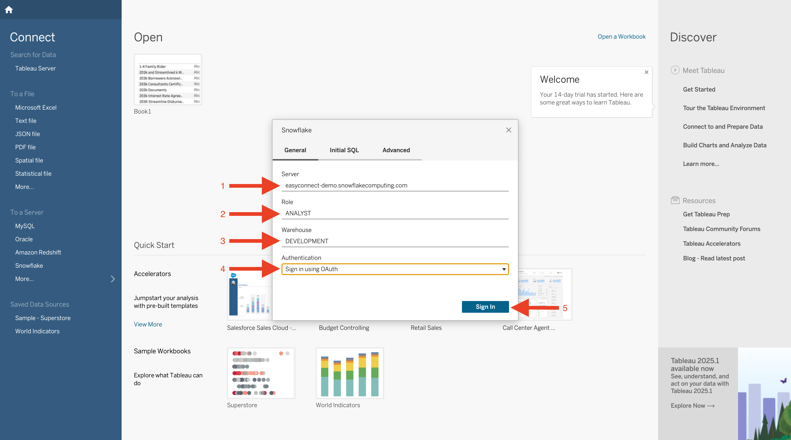

# Key Pair Authentication
In this tutorial we will show how to connect to snowflake via tableau with OAuth as the authenitcation method. Snowflake official documentation can be found here: 

## Video
Video is still in development.

## Requirement
This tutorial assumes you have nothing in your Snowflake account ([Trial](https://signup.snowflake.com/)) and no complex security needs.

!!! warning
    You can not use the ACCOUNTADMIN or SECURITYADMIN role by default. [Documentation on this block.](https://docs.snowflake.com/en/user-guide/oauth-partner#blocking-specific-roles-from-using-the-integration)

!!! Note
    If you do want to use ACCOUNTADMIN or SECURITYADMIN roles please submit a support ticket allowing it with the integration name created below.

## Snowflake
Lets start a worksheet and add either or both security integrations below.

=== ":octicons-image-16: Code"

    ```sql linenums="1"
    use role accountadmin;

    -- For tableau desktop
    create security integration tableau_desktop_oauth
    type = oauth
    enabled = true
    oauth_client = tableau_desktop;

    -- For tableau cloud
    create security integration tableau_cloud_oauth
    type = oauth
    enabled = true
    oauth_client = tableau_server;
    ```

## Tableau Desktop
Lets start by adding Snowflake as a source. Search for Snowflake in "Connect to Server".


Once Snowflake is selected you'll want to enter your Snowflake account URL (ADD PLUS HERE), role "CAN NOT BE ACCOUNTADMIN", warehouse and select sign in using OAuth.


Once you click "Sign in" a browser will appear for login/approval.


Login with your user.


Click allow for tableau to connect to your Snowflake user.


Success your OAuth is setup.


## Tableau Cloud

TBD for update.