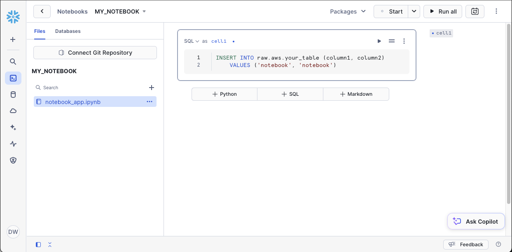
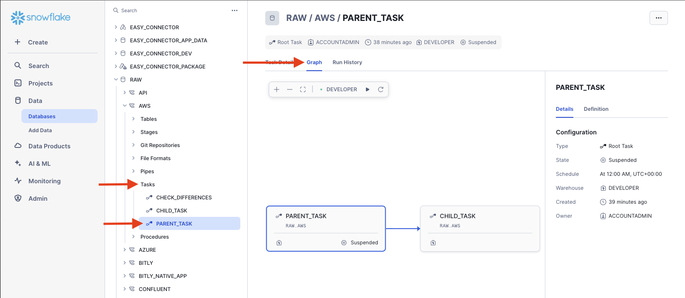

# Task Lineage
In this tutorial we will show how to child and partent tasks so that once the parent run the child will follow. We call this task lineage.

For the official Snowflake documentation this tutorial was based on:
[https://docs.snowflake.com/en/user-guide/tasks-graphs#create-a-task-graph](https://docs.snowflake.com/en/user-guide/tasks-graphs#create-a-task-graph)

## Video
Video is still in development.

## Requirement
This tutorial assumes you have nothing in your Snowflake account ([Trial](https://signup.snowflake.com/)) and no complex security needs.

## Setup :octicons-feed-tag-16:
Lets start the setup prcoess in Snowflake. 

??? note "If you don't have a database, schema or warehouse yet."

    === ":octicons-image-16: Database, schema and warehouse"

        ```sql
        use role sysadmin;
        
        -- Create a database to store our schemas.
        create database raw;

        -- Create the schema. The schema stores all our objectss.
        create schema raw.data;

        /*
            Warehouses are synonymous with the idea of compute
            resources in other systems. We will use this
            warehouse to call our user defined function.
        */
        create warehouse if not exists developer 
            warehouse_size = xsmall
            initially_suspended = true;

        use database raw;
        use schema data;
        use warehouse developer;
        ```


First lets start by setting up the table we'll enter data into.
=== ":octicons-image-16: Setup"

    ```sql linenums="1"
    create or replace table your_table (
        column1 string,
        column2 string
    );

    create or replace task parent_task
        warehouse = 'developer'
        schedule = 'USING CRON 0 0 * * * UTC' -- schedule to run daily at midnight
    as
        insert into raw.data.your_table (column1, column2)
        values ('task', 'task');
    ```   

=== ":octicons-image-16: Result"

    ``` linenums="1"
    Task PARENT_TASK successfully created.
    ```

Next lets create a Snowflake notebook named "my_notebook" and enter the sql below.


=== ":octicons-image-16: Notebook"

    ```sql linenums="1"
    insert into raw.data.your_table (column1, column2)
        values ('notebook', 'notebook')
    ```

Finally lets create the child task and resume the task so it runs after our parent task.
=== ":octicons-image-16: Setup"

    ```sql linenums="1"
    create or replace task child_task
        warehouse = 'developer'
        after parent_task
    as
        execute notebook raw.data.my_notebook();

    alter task child_task resume;
    ```

=== ":octicons-image-16: Result"

    ``` linenums="1"
    Statement executed successfully.
    ```

Lets run the notebook and see that once the task row is added, the notebook row follows.

    ```sql linenums="1"
    -- Run the task tree.
    execute task parent_task;

    -- Look at the results.
    select * from raw.aws.your_table;
    ```

=== ":octicons-image-16: Result"

    ``` linenums="1"
    | # | Column   | Column   |
    |---|----------|----------|
    | 1 | task     | task     |
    | 2 | notebook | notebook |
    ```

You can also see the task linage by going to the parent task in the UI.
