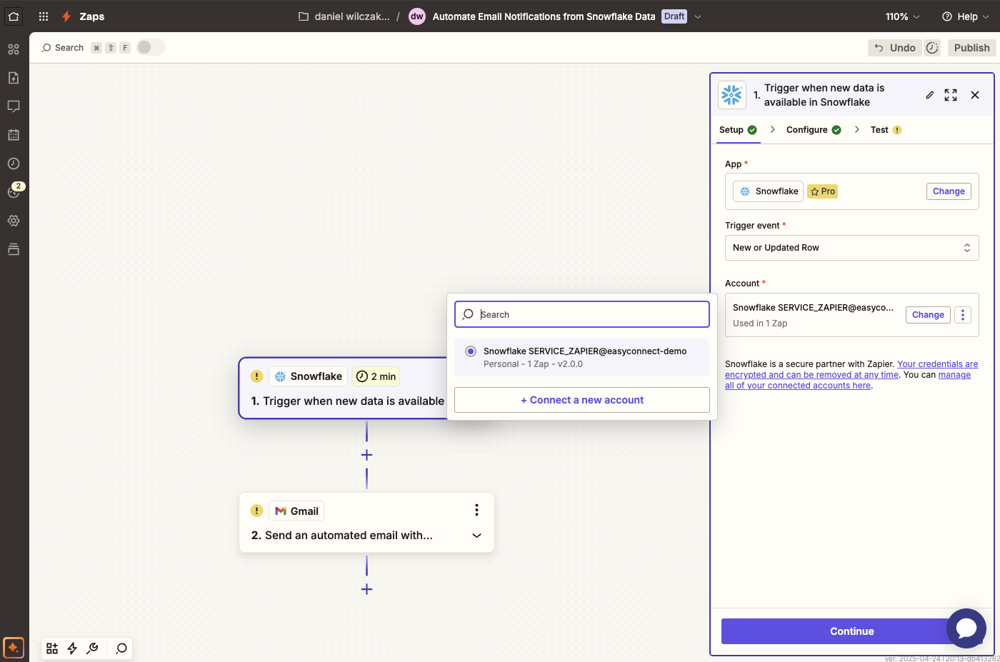

# Zapier - Setup
Goal of this tutorial is to setup the OAuth connection between Zapier and Snowflake. We'll follow up with how to reference Snowflake tables in Zapier.

## Video
Video still in development.

## Requirements
- Snowflake account, you can use a [free trial](https://signup.snowflake.com/). We also assume no complex security needs.
- Zapier account, you can setup a [free account](https://zapier.com/pricing) to get started.

## Setup  :octicons-feed-tag-16:
Lets start by setting up a Snowflake connection to Google Cloud Storage. After that we'll create and load data into some Iceberg tables.

### Zapier
Sign into your Zapier account and head to App Connections.


We'll add a new connection.


Search Snowflake and add the Snowflake option.


From there a window will open where we'll need to copy the redirect URI so that we can enter it into Snowflake to get both our client ID and client secret from Snowflake.


### Snowflake
Inside of Snowflake we'll open a new sql worksheet and add the code below with our redirect URI.

??? note "If you don't have a database, schema or warehouse yet."

    === ":octicons-image-16: Database, schema and warehouse"

        ```sql linenums="1"
        use role sysadmin;
        
        -- Create a database to store our schemas.
        create database if not exists raw;

        -- Create the schema. The schema stores all our objectss.
        create schema if not exists raw.zapier;

        /*
            Warehouses are synonymous with the idea of compute
            resources in other systems. We will use this
            warehouse to call our user defined function.
        */
        create warehouse if not exists development 
            warehouse_size = xsmall
            auto_suspend = 30
            initially_suspended = true;

        use database raw;
        use schema zapier;
        use warehouse development;
        ```


=== ":octicons-image-16: Template"

    ```sql linenums="1"  
    use role accountadmin;

    create or replace security integration oauth_zapier
      type = oauth
      enabled = true
      oauth_client = custom
      oauth_client_type = 'CONFIDENTIAL'
      oauth_redirect_uri = '<REDIRECT URI>' /* (1)! */
      oauth_issue_refresh_tokens = true
      oauth_refresh_token_validity = 7776000;

    with integration_secrets as (
      select parse_json(system$show_oauth_client_secrets('OAUTH_ZAPIER')) as secrets
    )

    select
      secrets:"OAUTH_CLIENT_ID"::string     as client_id,
      secrets:"OAUTH_CLIENT_SECRET"::string as client_secret
    from
      integration_secrets;
    ```
    { .annotate }

    1.  

    
=== ":octicons-image-16: Example"

    ```sql linenums="1"
    use role accountadmin;
    
    create or replace security integration oauth_zapier
      type = oauth
      enabled = true
      oauth_client = custom
      oauth_client_type = 'CONFIDENTIAL'
      oauth_redirect_uri = 'https://zapier.com/dashboard/auth/oauth/return/SnowflakeCLIAPI/'
      oauth_issue_refresh_tokens = true
      oauth_refresh_token_validity = 7776000;

    with integration_secrets as (
      select parse_json(system$show_oauth_client_secrets('OAUTH_ZAPIER')) as secrets
    )

    select
      secrets:"OAUTH_CLIENT_ID"::string     as client_id,
      secrets:"OAUTH_CLIENT_SECRET"::string as client_secret
    from
      integration_secrets;
    ```

=== ":octicons-sign-out-16: Result"

    | CLIENT_ID                    | CLIENT_SECRET                                |
    |------------------------------|----------------------------------------------|
    | E77FnK68beS......mKYD0CX1ZU= | iw+0Q8SKcZVkExnr77y....jgAT5HoCDWg8nyXZsDFo= |

After we have generated our client ID and client secret we'll want to add them to our zapier pop up window. Next we'll get our account name by going to our account setting page in Snowflake.


From there we will copy our Account Identifier to be added as our account in Zapier.


### Testing Connection
!!! warning 

    You can NOT use a user with accountadmin privligies to login. Please create a new user if you only have one user by:

    ```sql
    create user service_zapier PASSWORD='Password123456';
    grant role <role name> to user service_zapier;
    ```

Now we have finished adding in all the required information we might want to also preset the role, database and schema this can make our lives easier later on when we are referencing tables that we already know where they exist.


!!! warning 

    You can NOT use a user with accountadmin privligies to login. Please create a new user if you only have one user by:

    ```sql
    create user service_zapier PASSWORD='Password123456';
    grant role <role name> to user service_zapier;
    ```

Now login via your user that's not using account admin.


Once you login you'll be brought back into app connections where we can test the connection.


Click on the three dots and then test connection.


If the connection is successful your ready to build using Snowflake connection.


## Build :octicons-feed-tag-16:

Lets build using our connection, one first select your connection in the configuration settings.


Next we'll want to add our table, if you want to use the full path of the table you can select custom and then use the path via: <Database>.<Schema>.<Table or View>
